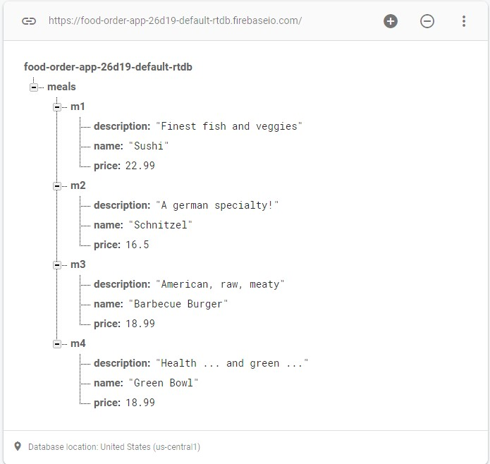

### 🍔 React Meal - Food Order App
***
#### 📌 Technologies: 
##### - React
##### - CSS modules
##### - Context
##### - Firebase
***
#### 📌 Firebase setup
##### 1. Go to google firebase
##### 2. Set up a project and choose a name
##### 3. Create a realtime database and choose a name
##
##### Note: I´ve chosen these settings for my project:
- Server location: **United States (us-central1)**
- Start in: **Test Mode**
- API URL: **https://food-order-app-26d19-default-rtdb.firebaseio.com/**
##
##### 4. Database population
Use this json file in order to populate de firebase realtime database:

```
[
  {
    id: 'm1',
    name: 'Sushi',
    description: 'Finest fish and veggies',
    price: 22.99,
  },
  {
    id: 'm2',
    name: 'Schnitzel',
    description: 'A german specialty!',
    price: 16.5,
  },
  {
    id: 'm3',
    name: 'Barbecue Burger',
    description: 'American, raw, meaty',
    price: 12.99,
  },
  {
    id: 'm4',
    name: 'Green Bowl',
    description: 'Healthy...and green...',
    price: 18.99,
  },
]
```
##
##### 5. The DB should look this way


***
#### 📌 Install dependencies
`yarn install`
***
#### 📌 Run development server
`yarn start`
***
#### 📌Screenshots: 


